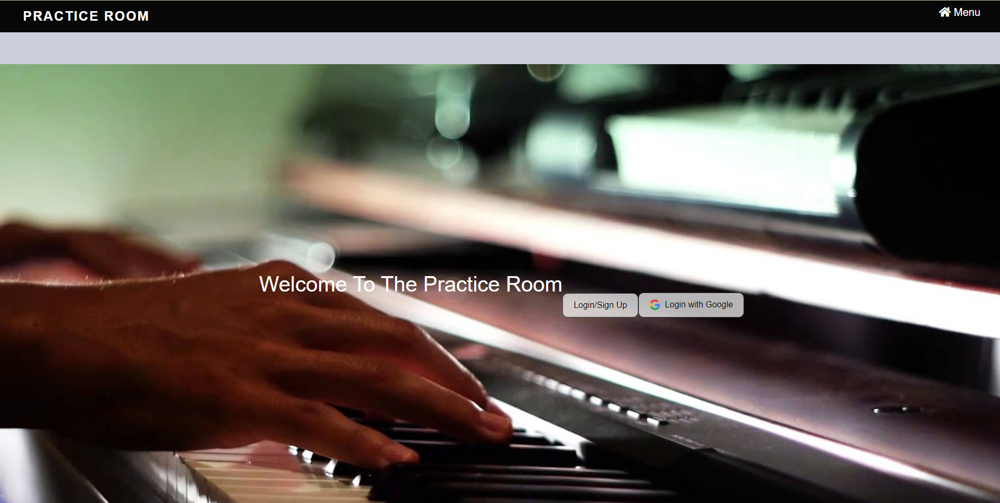

# Practice Room
## Description

This application is a resource/tool for music enthusiasts looking to post about music, find something new to listen to, or tune their instrument. User can create an account or use Google to sign in.
Once signed in, the user has access to post messages, use the song selector, and the artist search feature.  The front end was created using HTML/CSS/Boostrap with Handlebars.js as the view engine. Back end was created with node.js and utilizes a mySQL database. 

## Features

* Passport.js for login authentication
* Tuner feature - tune by ear or by specific instrument
* Randomized song selector to discover new music
* Artist search feature powered by SeatGeek.com

---

## Table of contents

* [Pictures](#pictures)

* [Usage](#usage)

* [Contributors](#contributors)

* [How to Contribute](#how-to-contribute)

* [Links](#links)

* [References](#references)

---
## Pictures

--- 

## Usage

Once signed up and signed in, user is redirected to the `posts` page where they are able to create/view posts. Clicking `menu` at the top right of the page will reveal a dropdown navbar to navigate through the site.

[Deployed heroku application](https://immense-savannah-04794.herokuapp.com/)

## Contributors

* [Elizabeth Berube](https://github.com/elizabethdberube)

* [Angela Donati](https://github.com/a-donati)

* [Marissa Flynn](https://github.com/ottercreektourism)

* [Reese Hartnett](https://github.com/pasfrad)

* [Michael Russiffilli](https://github.com/AllDeus)

## How to Contribute

To help add functionality, or for debugging/refactoring the code, please contact one of our team members to request access as a collaborator.

## Links

[GitHub Repo](https://github.com/AllDeus/PracticeRoom) 

[Deployed Application](https://immense-savannah-04794.herokuapp.com/) 

# References 

[Passport.js](https://www.passportjs.org/)

[Handlebars.js](https://www.npmjs.com/package/handlebars)

[SeatGeek API](http://platform.seatgeek.com/)
